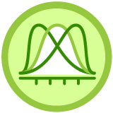

  <h1>Introducción al Pensamiento Probabilístico</h1>

 
  

# Introducción al documento

El contenido de este documento esta basado en el curso del mismo nombre dictado por [David Aroesti](https://github.com/jdaroesti) en [Platzi](https://platzi.com/r/karlbehrens/).

# Tabla de contenido
- [Programación probabilística](#Programación-probabilística)
    - [Introducción a la programación probabilística](#Introducción-a-la-programación-probabilística)
    - [Probabilidad condicional](#Probabilidad-condicional)
    - [Teorema de Bayes](#Teorema-de-Bayes)
    - [Ejercicio de Bayes en código](#Ejercicio-de-Bayes-en-código)
    - [Aplicaciones del Teorema de Bayes](#Aplicaciones-del-Teorema-de-Bayes)
- [Mentiras estadísticas](#Mentiras-estadísticas)
    - [Garbage in, garbage out](#Garbage-in,-garbage-out)
    - [Imágenes engañosas](#Imágenes-engañosas)
    - [Cum Hoc Ergo Propter Hoc](#Cum-Hoc-Ergo-Propter-Hoc)
    - [Prejuicio en el muestreo](#Prejuicio-en-el-muestreo)
    - [Falacia del francotirador de Texas](#Falacia-del-francotirador-de-Texas)
    - [Porcentajes confusos](#Porcentajes-confusos)
    - [Falacia de regresión](#Falacia-de-regresión)
- [Introducción a Machine Learning](#Introducción-a-Machine-Learning)
    - [Feature vectors](#Feature-vectors)
    - [Métricas de distancia](#Métricas-de-distancia)
- [Agrupamiento](#Agrupamiento)
    - [Introducción al agrupamiento](#Introducción-al-agrupamiento)
    - [Agrupamiento jerárquico](#Agrupamiento-jerárquico)
    - [Agrupamiento K-means](#Agrupamiento-K-means)
    - [Otras técnicas de agrupamiento](#Otras-técnicas-de-agrupamiento)
- [Clasificación](#Clasificación)
    - [Introducción a la clasificación](#Introducción-a-la-clasificación)
    - [Clasificación K-nearest neighbors](#Clasificación-K-nearest-neighbors)
    - [Otras tecnicas de clasificación](#Otras-tecnicas-de-clasificación)