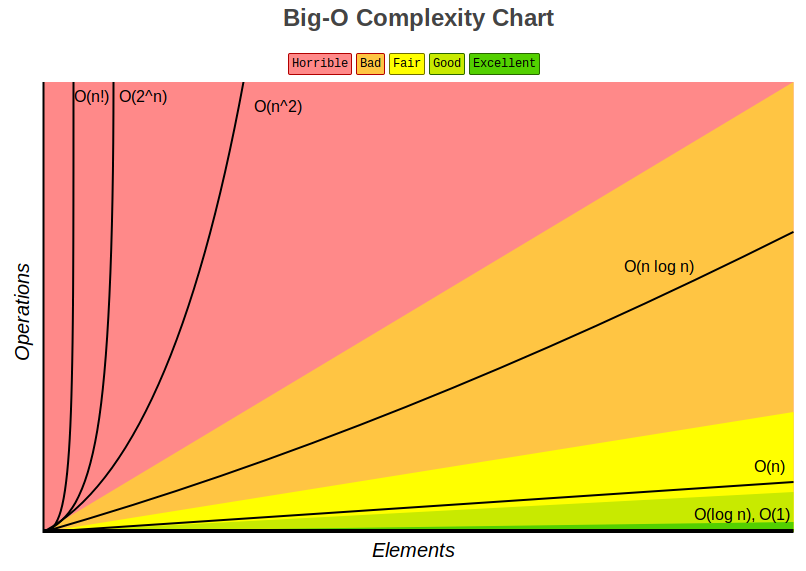
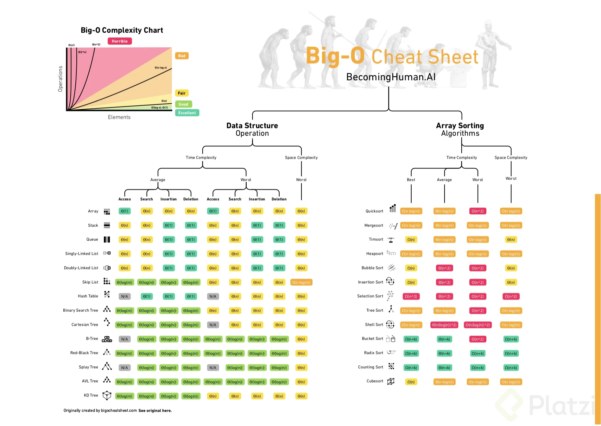

<div align="center">
  <h1>Programación Orientada a Objetos y Algoritmos con Python</h1>
</div>

<div align="center"> 
  
</div>

# Introducción al documento

El contenido de este documento esta basado en el curso del mismo nombre dictado por [David Aroesti](https://github.com/jdaroesti) en [Platzi](https://platzi.com/r/karlbehrens/).

# Tabla de Contenidos
- [Programación Orientada a Objetos](#Programación-Orientada-a-Objetos)
    - [Definición de clase](#Definición-de-clase)
    - [Abstracción](#Abstracción)
    - [Encapsulación](#Encapsulación)
    - [Getters and Setters](#Getters-and-Setters)
    - [Herencia](#Herencia)
    - [Polimorfismo](#Polimorfismo) 
- [Complejidad Algorítmica](#Complejidad-Algorítmica)
    - [Crecimiento Asintótico](#Crecimiento-Asintótico)
        - [Ley de la Suma](#Ley-de-la-suma)
        - [Ley de la Multiplicación](#Ley-de-la-multiplicación)
        - [Recursividad multiple](#Recursividad-multiple)
    - [Clases de complejidad algorítmica](#Clases-de-complejidad-algorítmica)
- [Algoritmos de búsqueda y Ordenación](#Algoritmos-de-búsqueda-y-Ordenación)
    - [Búsqueda lineal](#Búsqueda-lineal)
    - [Búsqueda binaria](#Búsqueda-binaria)
    - [Ordenamiento de burbuja](#Ordenamiento-de-burbuja)
    - [Ordenamiento por inserción](#Ordenamiento-por-inserción)
    - [Ordenamiento por mezcla](#Ordenamiento-por-mezcla)
- [Ambientes Virtuales](#Ambientes-Virtuales)


# Programación Orientada a Objetos
### Definición de clase

<pre><code>class &ltnombre_de_la_clase&gt (&ltsuper_clase&gt):

	def __init__(self, &ltparams&gt):
		&ltexpresion&gt

	def  &ltnombre_del_metodo&gt (self, &ltparams&gt):
		&ltexpresion&gt</code>
</pre>

Pueden exitir variables publicas y privadas en las clases y en los métodos. Sólo aplica para las variables y metodos en una clase (creo).

**Declaracion de una variable privada:**
Se ocupa un guion bajo antes del nombre de la variable para decir que es privada `_nombre_variable`

 **Declaracion de un método privado:** 
Ocupamos el mismo concepto de las variables privadas y lo aplicamos a los métodos, por ejemplo: `def _mi_metodo_privado()`

Ejemplo de un método privado y una variable privada:
```python
def _nombre_del_metodo_privado(self):
	self._variable_privada = True
```
Podemos llamar 2 metodos con el mismo nombre siempre y cuando sea uno privado y el otro público asi ` def _un_metodo` y `def un_metodo` pueden ser dos métodos completamente diferentes.

### Abstracción
- Enfocarnos en información relevante.
- Separar la información central de los detalles secundarios.

### Encapsulación
Programacion defensiva para determinar cuando y como se modifica una clase.
- Permite agrupar datos y su comportamiento.
- Controla el acceso a dichos datos.
- Previene modificaciones no autorizadas.

### Getters and Setters
El `@property` decorator nos permite definir un método al cual podemos acceder como si fuera un atributo o sea, podemoa acceder a el con el . (punto)

**Ejemplo:**
```python
class Employee:
    def __init__(self, first, last):
        self.first = first
        self.last = last

    @property   
    def email(self):#este metodo gracias al property maneja los datos mandados de emp_1
        return f"{self.first}.{self.last}@email.com"

    @property
    def fullname(self):
        return f"{self.first} {self.last}"

    @fullname.setter 
    def fullname(self, name): #este metodo es llamado en emp_1.fullname ya que le mandamos parametros para ser ocupados (setter)
        first, last = name.split(" ")
        self.first = first
        self.last = last

    @fullname.deleter 
    def fullname(self): #este metodo es llamado en emp_1.fullname
        print('delete Name!')
        self.first = None
        self.last = None


emp_1 = Employee('Bryan', 'Gonzalez') #de esta manera entra a la clase y solo realiza los metodos de email y fullname xq son getters
emp_1.fullname = "Pedo Gomez" #lo mandamos al setter de fullname y actualiza las variables de fiirst y last
del emp_1.fullname #nos vamos al fullname.deleter
```
Teniendo este código como ejemplo, podemos ver el `@property` decorator funcionando como un getter para el **fullname** y **email**

Para crear un setter tenemos que ocupar el `@[nombre_getter].setter` decorator.

Para cada setter tiene que haber cun getter llamado de la misma manera, por ejemplo:
```python
@property
def fullname(self):
    return f"{self.first} {self.last}"

@fullname.setter 
def fullname(self, name):
    first, last = name.split(" ")
    self.first = first
    self.last = last
```
En esta parte del código podemos ver que del el setter y el getter se llaman igual.

### Herencia
- Permite modelar una jerarquia de clases
- Permite compartir comportamiento común en la jerarquia
- Al padre se le conoce como **SuperClase** y al hijo como **subclase**

**Ejemplo:**

La manera en que la herencia funciona en python es la siguiente:
```python
class Rectangulo:

    def __init__(self, base, altura):
        self.base = base
        self.altura = altura
    
    def area(self):
        return self.base * self.altura
    
class Cuadrado(Rectangulo): #Al momento de definir la clase entre () le ponemos la super clase
    def __init__(self, lado): #es lo mismo que cuando en java o c# ponemos el extends y la otra clase
        super().__init__(lado, lado) #super() nos permite obtener una referencia directa de la superclase
```
`super().__init__(lado, lado)` en esta linea de código con `super()` logramos entrar al constructor de la clase **Rectangulo** pasandole los parámetro que necesita y asi poder hacer todo lo que esa clase puede hacer

### Polimorfismo
- La habilidad de tomar varias formas
- En python, nos permite cambiar el comportamiento de una superclase para adaptarlo a la subclase

**La mayor diferencia entre polimorfismo y herencia** es que el primeo busca cambiar el comportamiento de la super clase en la subclase, mientras que en la herencia solo se busca usar la estructura y comportamiento de la superclase en una subclase.

# Complejidad Algorítmica
Complejidad Temporal, es una funcion T(n) y determina el tiempo que el algoritmo tarda

### Crecimiento Asintótico
- No importan las variaciones pequeñas
- El enfoque se centra en lo suq pasa conforme el tamaño del problema se acerca al infinito.
- Mejor de los casos, promedio, peor de los casos
- Big O
- Nada mas importa el término de mayor tamaño

En Big O lo único que importa es el término mas grande sin importar el coeficiente

##### Ley de la suma
```python
def f(n):

    for i in range(n):
        print(i)
    
    for i in range(n):
        print(i)

# O(n) + O(n) = O(n + n) = O(2n) = O(n)

# CRECIMIENTO LINEAL

# La funcion crece en O(n)   
```
```python
def f(n):

    for i in range(n):
        print(i)
    
    for i in range(n * n):
        print(i)

# O(n) + O(n * n) = O(n + n²) = O(n²)

# FUNCION CUADRATICA  
```
#### Ley de la multiplicación
```python
#Cuando se tiene un loop dentro de otro loop las variables se multiplican

def f(n):
    for i in range(n):
        for j in range(n):
            print(i, j)

# O(n) * O(n) = O(n * n) = O(n²)
```
#### Recursividad multiple
```python
def fibonacci(n):
    if n == 0 or n == 1:
        return 1
    
    return fibonacci(n-1) + fibonacci(n-2)

#O(2^n)
```
### Clases de complejidad algorítmica
Existen distintos tipos de complejidad algorítmica:

- **O(1) Constante:** no importa la cantidad de input que reciba, siempre demorara el mismo tiempo.
- **O(n) Lineal:** la complejidad crecerá de forma proporcional a medida que crezca el input.
- **O(log n) Logarítmica:** nuestra función crecerá de forma logarítmica con respecto al input. Esto significa que en un inicio crecerá rápido, pero luego se estabilizara.
- **O(n log n) Log lineal:** crecerá de forma logarítmica pero junto con una constante.
- **O(n²) Polinomial:** crecen de forma cuadrática. No son recomendables a menos que el input de datos en pequeño.
- **O(2^n) Exponencial:** crecerá de forma exponencial, por lo que la carga es muy alta. Para nada recomendable en ningún caso, solo para análisis conceptual.
- **O(n!) Factorial:** crece de forma factorial, por lo que al igual que el exponencial su carga es muy alta, por lo que jamas utilizar algoritmos de este tipo.

<div align="center"> 
  
</div>
También podemos basarnos en esta imagen:

<div align="center"> 
  
</div>

# Algoritmos de búsqueda y Ordenación
Se busca aplicar los conceptos de complejidad algorítmica para la eficiencia de mejorar la resolucion de un problema

### Búsqueda lineal
La búsqueda lineal es un algoritmo muy sencillo. Consta en buscar si un elemento se encuentra dentro de una lista, array o un sistema ordenado o no ordenado para poder determinar si el elemento se encuentra en el o forma parte de el.

¿Cuál es el peor caso del siguiente código? Si nos fijamos existe un **for loop** que crece según el tamaño de la lista, por lo cual nuestro **Big O es O(n)**.
```python
def busqueda_lineal(lista, objetivo):
    match = False

    for elemento in lista: # tenemos un O(n)
        if elemento == objetivo:
            match = True
            break

    return match
```
### Búsqueda binaria
La **búsqueda binaria** toma una estrategia llamada *"Divide y conquista"*, la cual consiste en dividir el problema en 2 en cada iteración. Este algoritmo asume que la lista se encuentra ordenada, por lo que es necesario realizar este paso primero.

La **búsqueda binaria** es uno de los mejores algoritmos que se tienen hoy en día para búsqueda, ya que reduce significativamente el numero de pasos, y así disminuyendo nuestro Big O.

<div align="center">
  <h4>Caso Promedio</h4>
</div>

<div align="center"> 
  
</div>

<div align="center">
  <h4>Peor de los Casos</h4>
</div>

<div align="center"> 
  
</div>

<div align="center">
  <h4>Mejor de los Casos</h4>
</div>

<div align="center"> 
  
</div>

Para poder ocupar **búsqueda binaria** tenemos que tener una lista ordenada. Veremos un ejepmlo implementado en código:
```python
import random

def busqueda_binaria(lista, start, end, objetivo):
    print(f"Buscando: {objetivo} entre {lista[start]} y {lista[end - 1]}")
    if start > end:
        return False
    
    medio = (start + end) // 2

    if lista[medio] == objetivo:
        return True
    elif lista[medio] < objetivo:
        return busqueda_binaria(lista, medio + 1, end, objetivo)
    else:
        return busqueda_binaria(lista, start, medio - 1, objetivo)


if __name__ == "__main__":
    tamano_lista = int(input("De que tamaño será la lista?: "))
    objetivo = int(input("Qué número quieres encontrar?: "))
    
    lista = sorted([random.randint(0,100) for i in range(tamano_lista)])
    
    encontrado = busqueda_binaria(lista, 0, len(lista), objetivo)

    print(lista)
    print(f"El elemento {objetivo} {'está' if encontrado else 'no está'} en la lista")
```
# Ordenamiento de burbuja
Es un algoritmo que recorre repetidamente una lista que necesita ordenarse. Compara elementos adyacentes y los intercambia si estan en el orden incorrecto. Este procedimiento se repite hasta que no se requieren mas intercambios, lo que indica que la lista se encuentra ordenada.
<div align="center"> 
  
</div>

**Ejemplo:**
```python
def ordenamiento_burbuja(lista):
    n = len(lista)

    for i in range(n): # O(n) * O(n) = O(n*n) = O(n**2)
        for j in range(0, n - i - 1):
            if lista[j] > lista[j+1]:
                lista[j], lista[j+1] = lista[j+1], lista[j]

    return lista
```
# Ordenamiento por inserción
Es intuitivo y fácil de implementar, pero es muy
ineficiente para listas de gran tamaño.

Una lista es dividida entre una sublista ordenada y otra sublista desordenada.
Al principio, la sublista ordenada contiene un solo elemento, por lo que por
definición se encuentra ordenada.

A continuación se evalua el primer elemento dentro la sublista desordenada para
que podamos insertarlo en el lugar correcto dentro de la lista ordenada.

La inserción se realiza al mover todos los elementos mayores al elemento que
se está evauluando un lugar a la derecha.

Continua el proceso hasta que la sublista desordenada quede vacia y, por lo
tanto, la lista se encontrará ordenada.

**Ejemplo:**
Imagina que tienes la siguiente lista de números:

7, 3, 2, 9, 8

Primero añadimos 7 a la sublista ordenada:

**7**, 3, 2, 9, 8

Ahora vemos el primer elemento de la sublista desordenada y lo guardamos en
una variable para mantener el valor. A esa variable la llamaremos `valor_actual`.
Verificamos que 3 es menor que 7, por lo que movemos 7 un lugar a la derecha.

**7**, 7, 2, 9, 8 (valor_actual=3)

3 es menor que 7, por lo que insertamos el valor en la primera posición.

**3**, **7**, 2, 9, 8

Ahora vemos el número 2. 2 es menor que 7 por lo que lo movemos un espacio a la
derecha y hacemos lo mismo con 3.

**3**, **3**, **7**, 9, 8 (valor_actual=2)

Ahora insertamos 2 en la primera posición.

**2**, **3**, **7**, 9, 8

9 es más grande que el valor más grande de nuestra sublista ordenada por lo que
lo insertamos directamente en su posición.

**2**, **3**, **7**, **9**, 8

El último valor es 8. 9 es más grande que 8 por lo que lo movemos a la derecha:

**2**, **3**, **7**, **9**, 9 (valor_actual=8)

8 es más grande que 7, por lo que procedemos a insertar nuestro `valor_actual`.

**2, 3, 7, 8, 9**

Ahora la lista se encuentra ordenada y no quedan más elementos en la sublista
desordenada.

Esta es una forma de implementar el algoritmo anterior:
```python
def ordenamiento_por_insercion(lista):

    for indice in range(1, len(lista)):
        valor_actual = lista[indice]
        posicion_actual = indice

        while posicion_actual > 0 and lista[posicion_actual - 1] > valor_actual:
            lista[posicion_actual] = lista[posicion_actual - 1]
            posicion_actual -= 1

        lista[posicion_actual] = valor_actual
```
# Ordenamiento por mezcla
El ordenamiento por mezcla creado por John von Neumann el cual aplica el concepto de "divide y conquista". Primero divide una lista en partes iguales hasta que quedan sublistas de 1 o 0 elementos. Luego las recombina en forma ordenada.
<div align="center"> 
  
</div>

**Ejemplo:**
```python
def ordenamiento_mezcla(lista):
    if len(lista) > 1:
        medio = len(lista) // 2
        izquierda = lista[:medio]
        derecha = lista[medio:]
        print(izquierda, "-"*5, derecha)

        # llamada recursiva en cada mitad
        ordenamiento_mezcla(izquierda)
        ordenamiento_mezcla(derecha)

        # iteradores para recorrer las 2 sublistas
        i = 0
        j = 0
        # iterador para la lista principal 
        k = 0

        while i < len(izquierda) and j < len(derecha):
            if izquierda[i] < derecha[j]:
                lista[k] = izquierda[i]
                i += 1
            else:
                lista[k] = derecha[j]
                j += 1

            k += 1

        while i < len(izquierda):
            lista[k] = izquierda[i]
            i += 1
            k += 1

        while j < len(derecha):
            lista[k] = derecha[j]
            j += 1
            k += 1
        
        print(f"izquierda: {izquierda}, derecha {derecha}")
        print(lista)
        print("-" * 20)

    return lista 
```
# Ambientes Virtuales
Los ambientes virtuales permiten aislar el ambiente para poder instalar diversas versiones de paquetes. A partir de python 3 se incluye en la librería estándar en el módulo venv. Ningún ingeniero profesional de Python trabaja sin ellos.

Pip permite descargar paquetes de terceros para utilizar en nuestro programa, también permite compartir nuestros paquetes con terceros y también podemos definir la versión del paquete que necesitamos.

Para crear un ambiente virtual primer crearemos el directorio para nuestro proyecto.
```
mkdir graficado             # Creamos el directorio del proyecto.
cd graficado/               # Ingresamos al directorio.
python3 -m venv env         # Creamos un ambiente virtual en env.
source env/bin/activate     # Activamos el ambiente.
```
Para desactivar el ambiente virtual lo haremos con el siguiente comando.
```
deactivate          # Comando para desactivar ambiente Virtual
```
# Graficado
### ¿Por qué graficar?
Es importante que podamos traducir los datos que nos arrojan nuestro programa en un elemento visual, así podemos realizar reconocimientos de patrones, predicción de series, simplifica la interpretación y la conclusión acerca de los datos.
<div align="center"> 
  
</div>

### Graficado Simple
La librería **Bokeh** permite construir gráficas complejas de manera rápida y con comandos simples, también nos permite exportar a varios formatos como html, notebooks, imágenes, etc. **Bokeh** se puede utilizar en el servidor con **Flask** y **Django**.

**Ejemplo**
```python
from bokeh.plotting import figure, output_file, show

if __name__ == "__main__":
    output_file("graficado_simple.html")
    fig = figure()

    total_vals = int(input("Cuantos valores quieres graficar?: "))
    x_vals = list(range(total_vals))
    y_vals = []

    for x in x_vals:
        val = int(input(f"Valor Y para {x}: "))
        y_vals.append(val)
    
    fig.line(x_vals, y_vals, line_width=2)
    show(fig) 
```
# Algoritmos de optimización
### Introducción a la optimización
El concepto de optimización permite resolver muchos problemas de manera computacional. Cuando pensamos en un algoritmo de optimización debemos definir una función objetivo que debemos maximizar o minimizar, respetando una serie de limitantes que definamos.

### El problema del morral
<div align="center"> 
  
</div>

Imagina que eres un ladrón que entra a un museo pero tienes un gran problema, nada mas tienes una mochila pero hay muchísimas cosas mas de las que puedes cargar, por lo cual debes determinar cuales artículos puedes cargar y te entregaran el mayor valor posible.

Para este problema sabemos que no podemos dividir los artículos, por lo que nuestra primera aproximación sera evaluar los artículos.
```python
def morral(tamano_morral, pesos, valores, n):
    if n == 0 or tamano_morral == 0:
        return 0
    
    if pesos[n - 1] > tamano_morral:
        return morral(tamano_morral, pesos, valores, n - 1)
    
    return max(valores[n - 1] + morral(tamano_morral - pesos[n - 1], pesos, valores, n - 1),
        morral(tamano_morral, pesos, valores, n -1))


if __name__ == "__main__":
    valores = [60, 100, 120]
    pesos = [10, 20, 30]
    tamano_morral = 5
    n = len(valores)

    resultado = morral(tamano_morral, pesos, valores, n)
    print(resultado)
```