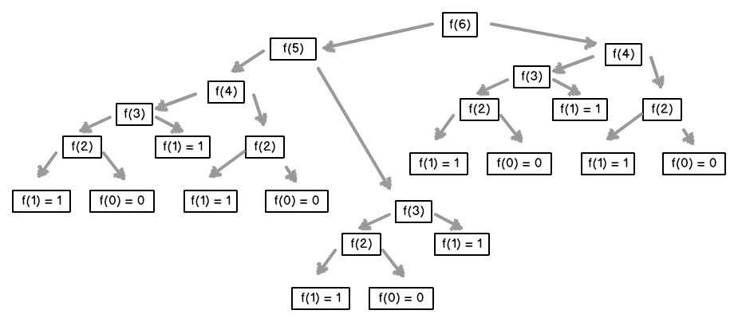
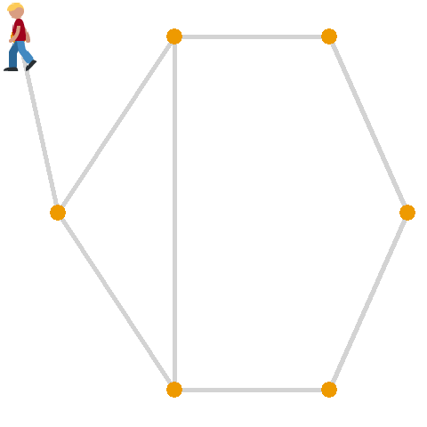
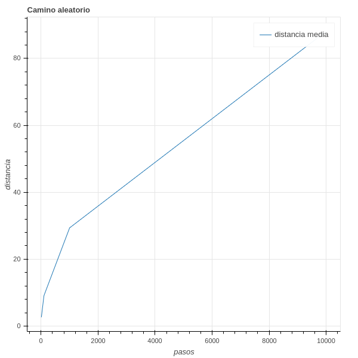

<div align="center">
  <h1>Programación Dinámica y Estocástica con Python</h1>
</div>

<div align="center"> 
  
</div>

# Introducción al documento 
El contenido de este documento esta basado en el curso del mismo nombre dictado por [David Aroesti](https://github.com/jdaroesti) en [Platzi](https://platzi.com).

**Objetivos:** 
- Aprender cuándo utilizar Programación Dinámica y sus beneficios.
- Entender la diferencia entre programas deterministas y estocásticos. 
- Aprender a utilizar Programación Estocástica.
- Aprender a crear simulaciones computacionales válidas.

# Tabla de Contenidos
- [Programación Dinámica](#Programación-Dinámica)
    - [Introducción a la Programación Dinámica](#Introducción-a-la-Programación-Dinámica)
    - [Optimización de Fibonacci](#Optimización-de-Fibonacci)
- [Caminos Aleatorios](#Caminos-Aleatorios)
    - [¿Qué son los caminos aleatorios?](#¿Qué-son-los-caminos-aleatorios?)
    - [Camino de Borrachos](#Camino-de-Borrachos)

# Programación Dinámica
### Introducción a la Programación Dinámica
sabiendo que **Programación Dinámica** no esta relacionado con su nombre, lo cierto es que si es una de las técnicas mas poderosas para poder optimizar cierto tipos de problemas.

Los problemas que puede optimizar son aquellos que tienen una **subestructura óptima**, esto significa que una **solución óptima global** se puede encontrar al combinar **soluciones óptimas de subproblemas locales**.

También nos podemos encontrar con los **problemas empalmados**, los cuales implican resolver el mismo problema en varias ocasiones para dar con una solución óptima.

Una técnica para obtener una alta velocidad en nuestro programa es la **Memorización**, el cual consiste en guardar cómputos previos y evitar realizarlos nuevamente. Normalmente se utiliza un diccionario, donde las consultas se pueden hacer en `O(1)`, y para ello hacemos un cambio de tiempo por espacio.

### Optimización de Fibonacci
La serie de Fibonacci se representa como `Fn = Fn-1 + Fn-2` y es muy simple implementarla de forma recursiva en código. Sin embargo es muy ineficiente hacerlo simplemente recursivo, ya que repetimos varias veces el mismo computo.
<div align="center"> 
  
</div>

Si te fijas en la imagen te darás cuenta de que repetimos varias veces el calculo para `f(4), f(3), f(2), f(1) y f(0)`, esto significa que nuestro algoritmo crece de forma **exponencial** `O(2^n)`.

Para optimizar nuestro algoritmo implementaremos en primer lugar la función recursiva para luego dar paso a la **memorización**, con esto las mejoras serán realmente sorprendentes.

**Ejemplo:**
```python
def fibonacci_dinamico(n, memo = {}):
    if n == 0 or n == 1:
        return 1 
    
    try:
        return memo[n]
    except KeyError:
        resultado = fibonacci_dinamico(n-1, memo) + fibonacci_dinamico(n - 2, memo)
        memo[n] = resultado
        return resultado


if __name__ == "__main__":
    n = int(input("Escoge un número: "))
    resultado = fibonacci_dinamico(n)
    print(resultado)
```
# Caminos Aleatorios
### ¿Qué son los caminos aleatorios?
Los **caminos aleatorios** son un tipo de simulación que elige aleatoriamente una decisión dentro de un conjunto de decisiones válidas. Se utiliza en muchos campos del conocimiento cuando los sistemas **no son deterministas** e incluyen **elementos de aleatoriedad**.
### Camino de Borrachos
Este es un ejercicio donde empezando desde un punto 0 aleatoriamente podemos decidir que dirección tomar, dependiendo de las opciones establecidas.
<div align="center">
    
</div>

Para realizar un ejemplo de aleatoriedad vamos a crear un programa que representara el problema del "Camino de Borrachos". Para esto crearemos 3 clases: uno que represente al **agente que camina**, una que genere una **abstracción de las coordenadas** y una que represente el **plano** en el cual nos estamos moviendo, y vamos a graficar la distancia en la que termina nuestro agente a medida que definimos una mayor cantidad de pasos que puede dar.

Primero crearemos un ambiente virtual, para ello vamos a la terminar.
```
mkdir camino_de_borramos    # Creamos una carpeta para nuestro proyecto.
cd camino_de_borrachos      # Ingresamos a la carpeta.
python3 -m venv env         # Creamos nuestro ambiente virtual.
source env/bin/activate     # Activamos nuestro ambiente.
pip install bokeh           # Instalamos el paquete de bokeh para generar nuestra gráfica.
```
Luego de haber creado nuestro entorno de trabajo creamos los siguientes archivos en nuestra carpeta.
```python
# Creamos un archivo borracho.py
import random

class Borracho:

    def __init__(self, name):
        self.name = name

    
# Creamos la clase BorrachoTradicional que extiende de Borracho.
class BorrachoTradicional(Borracho):

    def __init__ (self, name):
        super().__init__(name)
    
    # Método que decide la dirección a la que irá 
    def camina(self):
        # Con random.choice elegimos un elemento aleatoriamente de la lista.
        return random.choice([ (0, 1), (0, -1), (1, 0),(-1, 0) ])
```
```python
# Creamos un archivo coordenada.py

# La clase Coordenada guardara las coordenadas de nuestro agente
class Coordenada:

    # Definipos las coordenadas iniciales de nuestro agente   
    def __init__(self, x, y):
        self.x = x
        self.y = y

    # dx y dy es cuanto nos estamos moviendo en cada dirección 
    # Y cuando se mueve simplemente a las coordenadas actuales se les
    # suma las coordenadas X e Y que ingresan como parámetros.
    def mover(self, dx, dy):
        return Coordenada(self.x + dx, self.y + dy)
    
    # Sólo obtenemos la distancia entre los puntos con el teorema de pitagoras alv
    def distancia(self, otra_coordenada):
        dx = self.x - otra_coordenada.x
        dy = self.y - otra_coordenada.y

        return (dx**2 + dy**2)**0.5
```
```python
# Creamos un archivo campo.py
class Campo:

    # Nuestra clase tendrá como atributo un diccionario.
    def __init__(self):
        self.coordenada_de_borracho = {}

    # Añadimos un agente a nuestro diccionario, nuestra llave sera
    # nuestro parámetro "borracho" y tendrá el valor asignado "coordenada"
    # que es una clase Coordenada creado en coordenada.py.
    def anadir_borracho(self, borracho, coordenada):
        self.coordenada_de_borracho[borracho] = coordenada

    
    def mover(self, borracho):
        # Al mover a nuestro agente ejecutamos el método camina de
        # nuestra clase BorrachoTradicional creado en el archivo borracho.py,
        # devolviendo la dirección hacia donde se movió.
        dx, dy = borracho.camina()

        # Obtenemos el objeto de Coordenada.
        coordenada_actual = self.coordenada_de_borracho[borracho]

        # Del objeto Coordenada ejecutamos el método mover con los parámetros
        # que el objeto borracho genero. El resultado lo guardamos en
        # nueva_coordenada.
        nueva_coordenada = coordenada_actual.mover(dx, dy)
        
        # El objeto guardado en nueva_coordenada ahora estará asociado
        # a la llave de borracho.
        self.coordenada_de_borracho[borracho] = nueva_coordenada

    
    def obtener_coordenada(self, borracho):
        return self.coordenada_de_borracho[borracho]
```
```python
# Creamos el archivo camino_aleatorio.py

# Importamos las clases que creamos anteriormente.
from borracho import BorrachoTradicional
from campo import Campo
from coordenada import Coordenada

# Importamos bokeh para generar un gráfico con nuestros resultados.
from bokeh.plotting import figure, show


def caminata(campo, borracho, pasos):
    # De la instancia Campo obtenemos las coordenadas actuales de la llave "borracho".
    inicio = campo.obtener_coordenada(borracho)

    # Repetiremos la misma cantidad de pasos definidos.
    for _ in range(pasos):
        # De la instancia campo ejecutaremos mover_borracho.
        campo.mover(borracho)

    # Y devolveremos la distancia entre las coordenadas de la instancia
    # inicio y campo.
    return inicio.distancia(campo.obtener_coordenada(borracho))


def simular_caminata(pasos, num_intentos, tipo_borracho):

    # Definimos los parámetros para crear una instancia de Campo.
    borracho = tipo_borracho(name="Bryan")
    origen = Coordenada(0,0)

    # Creamos una lista que guardara las distancias en cada simulación.
    distancias = []

    # Por cada numero de intento.
    for _ in range(num_intentos):

        # Creamos una instancia de Campo.
        campo = Campo()

        # A nuestra instancia de Campo le damos la llave borracho y sus coordenadas de origen.
        campo.anadir_borracho(borracho, origen)

        # Obtenemos la distancia final de la simulación.
        simulacion_caminata = caminata(campo, borracho, pasos)

        # El resultado lo guardamos en la lista de distancias.
        distancias.append(round(simulacion_caminata, 1))
    
    # Retornamos la lista de distancias.
    return distancias


def graficar(x, y):
    # Creamos una instancia de figure, con su titulo y las etiquetas de los ejes.
    grafica = figure(title='Camino aleatorio', x_axis_label='pasos', y_axis_label='distancia')
 
    # Ingresamos los datos de X e Y.
    grafica.line(x, y, legend='distancia media')

    # Generamos una gráfica en HTML.
    show(grafica)


def main(distancias_caminata, num_intentos, tipo_borracho):

    # Creamos una lista que guardara el promedio de cada caminata.
    distancias_media_por_caminata = []

     # Por cada ítem en nuestras series de caminata.
    for pasos in distancias_caminata:
        # Guardamos las distancias que generan todas las simulaciones definido en numero_de_intentos.
        distancias = simular_caminata(pasos, num_intentos, tipo_borracho)

        # De la lista de distancias obtenemos la distancia promedio.
        distancia_media = round(sum(distancias) / len(distancias), 4)

        # De la lista de distancias obtenemos el máximo valor.
        distancia_max = max(distancias)

        # De la lista de distancias obtenemos el menor valor.
        distancia_min = min(distancias)

        # Guardamos el promedio de la caminata en la lista distancias_media_por_caminata.
        distancias_media_por_caminata.append(distancia_media)

        # Imprimimos los datos de la caminata actual.
        print(f"{tipo_borracho.__name__} tuvo una caminata aleatoria de {pasos}")
        print(f"Media = {distancia_media}")
        print(f"Max = {distancia_max}")
        print(f"Min = {distancia_min}")

    # Generamos un gráfico con la información de las distancias finales según la cantidad de pasos.
    graficar(distancias_caminata, distancias_media_por_caminata)


if __name__ == "__main__":
    # Definamos cuantos pasos queremos que camine en cada serie
    distancias_caminata = [10, 100, 1000, 10000]

     # Determinamos la cantidad de simulaciones que generara en cada serie.
    num_intentos = 100

    # Ejecutamos el método main con los parámetros definidos anteriormente
    # y además pasamos la clase BorrachoTradicional
    main(distancias_caminata, num_intentos, BorrachoTradicional)
```
Dentro el pensamiento **estocástico** debemos realizar varias simulaciones, por ese motivo en el ejemplo anterior realizamos varios intentos. Lo importante de esta aleatoriedad es que podemos distribuirla a lo largo de varios intentos, con esto podemos obtener certeza de que el comportamiento de nuestro programa se comporte en que esperamos estadísticamente.

Para ejecutar nuestro programa iremos nuevamente a la consola.
```
python3 camino_aleatorio.py 
BorrachoTradicional tuvo una caminata aleatoria de 10
Media = 2.554
Max = 8.2
Min = 0.0
BorrachoTradicional tuvo una caminata aleatoria de 100
Media = 8.878
Max = 21.6
Min = 0.0
BorrachoTradicional tuvo una caminata aleatoria de 1000
Media = 30.025
Max = 91.9
Min = 2.0
BorrachoTradicional tuvo una caminata aleatoria de 10000
Media = 92.124
Max = 230.1
Min = 5.1
```
Y nuestra gráfica en HTML se vera así.
<div align="center">
    
</div>
